# 🏆 Football Market Value Analysis: Unveiling the Price Tags of the Beautiful Game


---

## 🎯 Project Overview

This project analyzes the market values of football players, exploring various factors that influence their worth in the transfer market. By examining player performance metrics, league dynamics, and other relevant variables, the analysis aims to gain insights into the complex world of football economics.


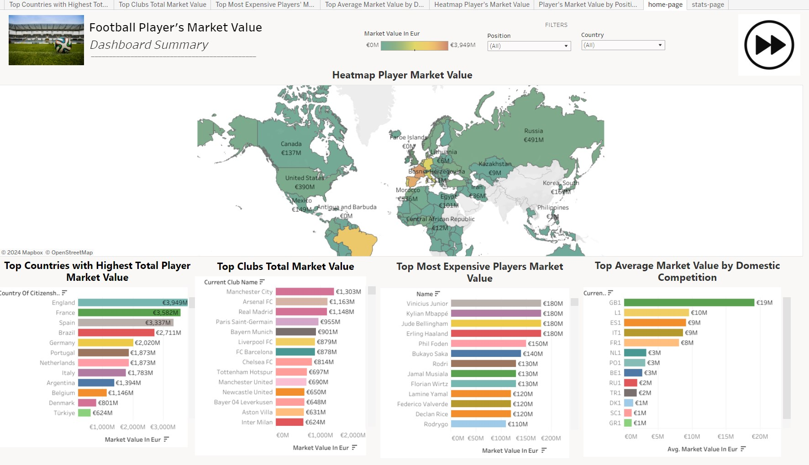

[Data Visualization](https://public.tableau.com/app/profile/ayudha.amari.hirtranusi/viz/h8dsft_Milestone1_Ayudha_Amari/home-page)

**Note**: For simplicity, this project focuses solely on data from the 2023 season.

---

## 📊 Key Objectives

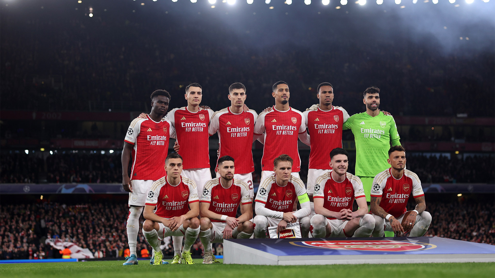


1. 🔍 Identify players with the highest market value currently
2. 🏋️ Investigate the relationship between physical attributes and market value
3. 🌟 Analyze factors contributing most to a player's market value (age, position, performance metrics)
4. 🌍 Explore the geographical distribution of high-value players
5. 🧮 Understand discrepancies in market values for players with similar performance metrics
6. 📈 Develop strategies to optimize training programs for improving player market value
7. 🏆 Determine which league contributes to the highest market value
8. 💼 Identify the club with the highest market value

---

## 💡 Key Findings

1. **Top-Valued Players**: 

   - 👑 Kylian Mbappé, Jude Bellingham, Vinicius Junior, and Erling Haaland lead with €180 million each
   - 💰 Top 10 most expensive players valued between €120 million and €180 million

        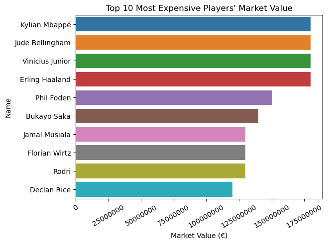

<br>

2. **League Impact**: 

   - 🏴󠁧󠁢󠁥󠁮󠁧󠁿 English Premier League (GB1) shows highest average market value among top European leagues

        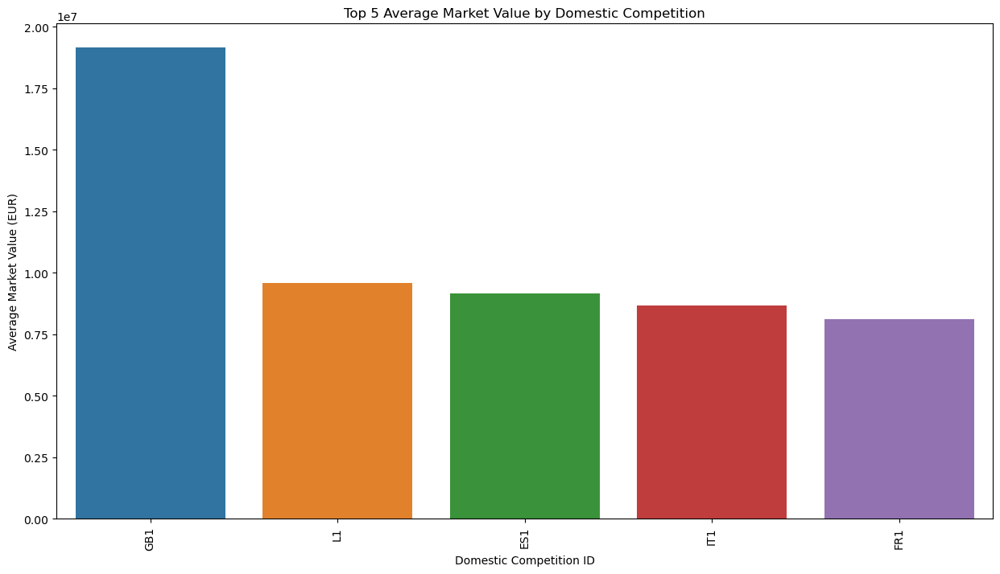

<br>

3. **Physical Attributes**: 

   - 🤔 Relationship between height, dominant foot, and market value explored

      <div style="display: flex; justify-content: space-between;">
      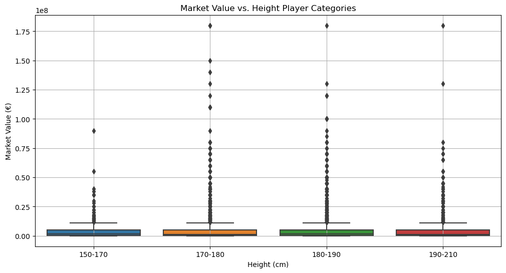
      <br>
      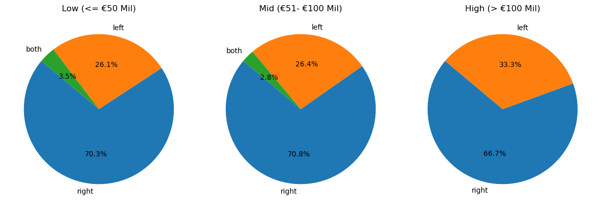

   </div>

<br>

4. **Performance Metrics**: 

   - ⚽ Goals, assists, and minutes played to be analyzed for correlation with market value
   - 📊 Investigation into performance-value discrepancies among high-performing players

      <div style="display: flex; justify-content: space-between;">
      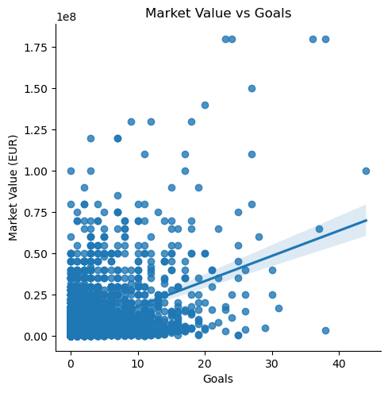
      <br>
      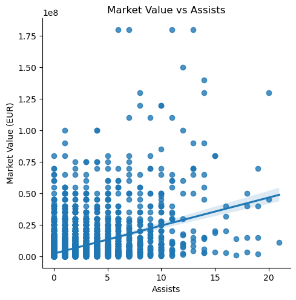
      <br>
      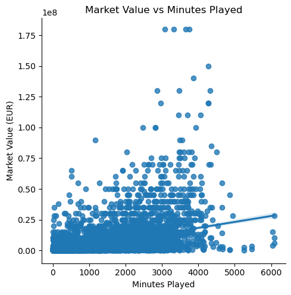
   </div>

<br>

... and many other things *(see notebook for details)*

---

## 🔬 Data Analysis

The analysis will include various visualizations and statistical methods to uncover patterns:

- 📊 Distribution of market values across different leagues
- 🔗 Correlation between performance metrics and market values
- 🧮 Clustering of players based on attributes and market values
- 🌍 Geographical analysis of high-value players

---

## 📊 Data Sources

This project utilizes two primary data sources:

1. **[Player Scores Dataset (Kaggle)](https://www.kaggle.com/datasets/davidcariboo/player-scores)**: A kaggle dataset that on a high level, uses transfermarkt-scraper to pull the data from Transfermark website and a set of Python scripts and SQL to curate it and publish it there. 


Clean, structured and automatically updated football data from Transfermarkt, including:

   ```
   - 60,000+ games from many seasons on all major competitions
   - 400+ clubs from those competitions
   - 30,000+ players from those clubs
   - 400,000+ player market valuations historical records
   - 1,200,000+ player appearance records from all games
   - and more!
   ```

The dataset is composed of multiple CSV files with information on competitions, games, clubs, players and appearances that is automatically updated **once a week** by the original author. Each file contains the attributes of the entity and the IDs that can be used to join them together.

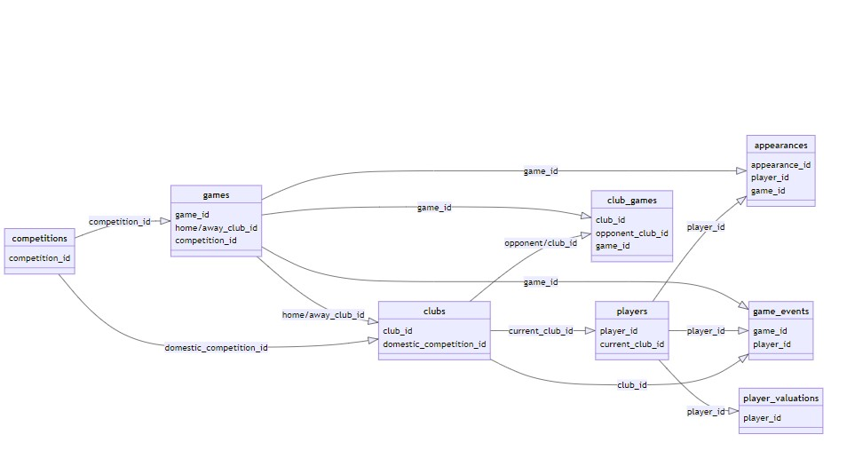

---

2. **[Transfermarkt](https://www.transfermarkt.co.uk/)**: The leading website for football transfer news and market valuations.

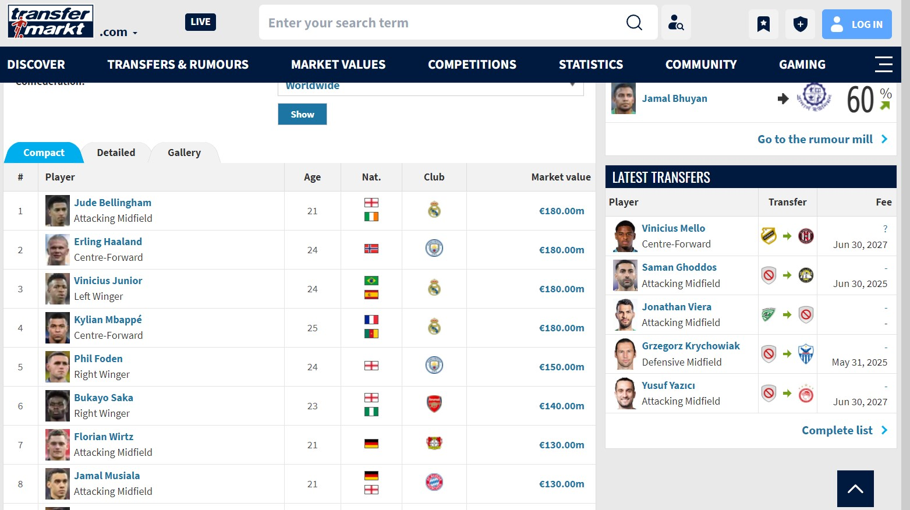

From Transfermarkt, we will gather the following key information for each player:

- *Player Name*
- *Current Team*
- *Domestic league in which player's team competes*
- *Age*
- *Playing position*
- *Nationality*
- *Years Left on Contract*
- *Transfer Value (our main variable)*

These data points have been identified as significant determinants of a player's market value based on the available information from Transfermarkt.

---

## 🚀 Future Goals

The project aims to provide insights that could potentially increase the overall market value of players by optimizing performance metrics and understanding market value determinants.

---

## 💼 Business Problem

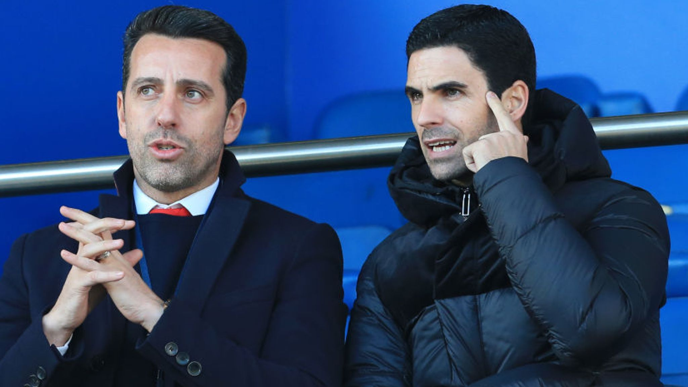

In the dynamic world of football, player valuations have become a critical aspect of club management and transfer strategies. This analysis aims to address the following key questions:

1. **Performance Metrics**: How do goals, assists, and other on-field statistics influence a player's market value?
2. **Age and Potential**: What role does a player's age and perceived potential play in their valuation?
3. **League Prestige**: How does playing in top-tier leagues like the Premier League or La Liga affect a player's worth?
4. **International Reputation**: What impact do international performances and national team status have on market value?
5. **Transfer History**: How do past transfer fees and frequency of transfers affect a player's current valuation?
6. **Position Specifics**: Are certain playing positions valued more highly than others in the transfer market?
7. **Club Status**: How does the reputation and financial power of a player's current club influence their market value?
8. **Injury History**: To what extent do past injuries and perceived injury risk affect a player's valuation?

[... and all other things ...]

By leveraging advanced data analysis techniques, this project aims to provide insights for clubs to optimize their transfer strategies, financial planning, and player development programs.

---

## 📁 Dashboard Visualization

[Data Visualization](https://public.tableau.com/app/profile/ayudha.amari.hirtranusi/viz/h8dsft_Milestone1_Ayudha_Amari/home-page)

---

## 👨‍💻 Contributor

**Ayudha Amari Hirtranusi** 
- 🌐 **Github**: [www.github.com/ayudhaamari](https://github.com/ayudhaamari)
- 💼 **LinkedIn**: [www.linkedin.com/in/ayudhaamari/](https://www.linkedin.com/in/ayudhaamari/)
- 📧 **Email**: amariayudha@gmail.com